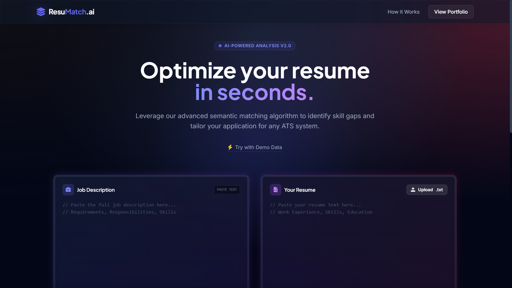

# ResuMatch AI | Smart ATS Resume Scanner

A modern, single-page **AI-Powered Resume Analyzer** designed to simulate Applicant Tracking Systems (ATS). This tool helps job seekers optimize their resumes by comparing them against job descriptions using client-side semantic matching algorithms. All analysis is done locally in your browser—no data ever leaves your device.

---

## ✨ Features

- **🚀 Instant Analysis:** Real-time parsing of Job Descriptions and Resumes without backend processing.
- **📊 Smart Scoring Engine:** Calculates a "Match Percentage" based on keyword density, hard skills overlap, and formatting health.
- **🔍 Gap Detection:** Identifies critical keywords missing from the resume that are present in the job description.
- **📱 Fully Responsive:** Optimized for mobile and desktop with a modern "Glassmorphism" UI.
- **🔒 Privacy First:** All analysis happens locally in the browser; no data is sent to any server.
- **📄 Report Generation:** Download analysis results as a PDF (via Print) or Text file.
- **🎨 Modern Design:** Built with Tailwind CSS for a polished, professional SaaS aesthetic.

---

## 🖼️ Preview

<!-- Optionally add a GIF or screenshot here -->


---

## 🛠️ Tech Stack

- **Frontend:** HTML5, CSS3, Vanilla JavaScript (ES6+)
- **Styling:** Tailwind CSS (CDN)
- **Typography:** Google Fonts (Plus Jakarta Sans & Inter)
- **Icons:** FontAwesome 6

---

## 📦 Project Structure

```
AI-Resume-Analyzer/
├── index.html      # Main HTML file
├── style.css       # Custom styles
├── script.js       # Main JavaScript logic
├── README.md       # Documentation
```

---

## 🚦 How to Run

1. **Clone the repository:**
	```sh
	git clone https://github.com/mohan-dev-portfolio/AI-Resume-Analyzer.git
	cd AI-Resume-Analyzer
	```
2. **Open the Application:**
	- Double-click `index.html` to open in your browser, or
	- Use a local server (e.g., Live Server for VS Code) for best results.

> _Requires an internet connection for CDN assets (Tailwind, FontAwesome, Google Fonts)._

---

## 💡 How It Works (The "AI" Logic)

The "AI" component is simulated using advanced JavaScript text processing techniques:

- **Tokenization:** The engine creates regex-based tokens from the Job Description.
- **Stop-Word Removal:** Filters out common English words (e.g., "the", "and", "with") to isolate high-value keywords.
- **Semantic Matching:** Compares the Resume against the Job Description tokens to find exact and partial matches.
- **Weighted Scoring:**
  - 70%: Content Relevance (Keyword overlap)
  - 30%: Formatting Health (Presence of contact info, appropriate length, etc.)

---

## 🙋‍♂️ Contributing

Pull requests are welcome! For major changes, please open an issue first to discuss what you would like to change.

---

## 👤 Author

**Mohan Prasath**  
[🌐 Portfolio](https://mohan-dev-portfolio.github.io/Portfolio/)  
[🐙 GitHub](https://github.com/mohan-dev-portfolio)  
[💼 LinkedIn](https://www.linkedin.com/in/mohanprasath-dev/)

---

## 📄 License

This project is open source and available under the MIT License.

> _Note: This project is a portfolio demonstration. While it simulates ATS logic effectively, actual enterprise ATS algorithms may vary._
